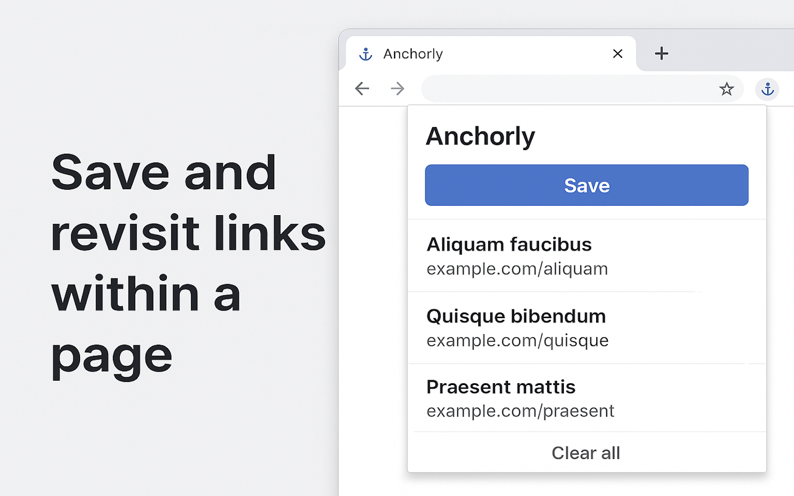
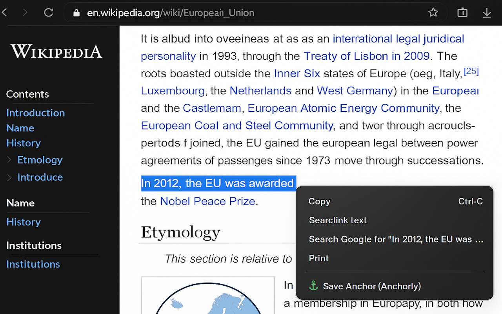
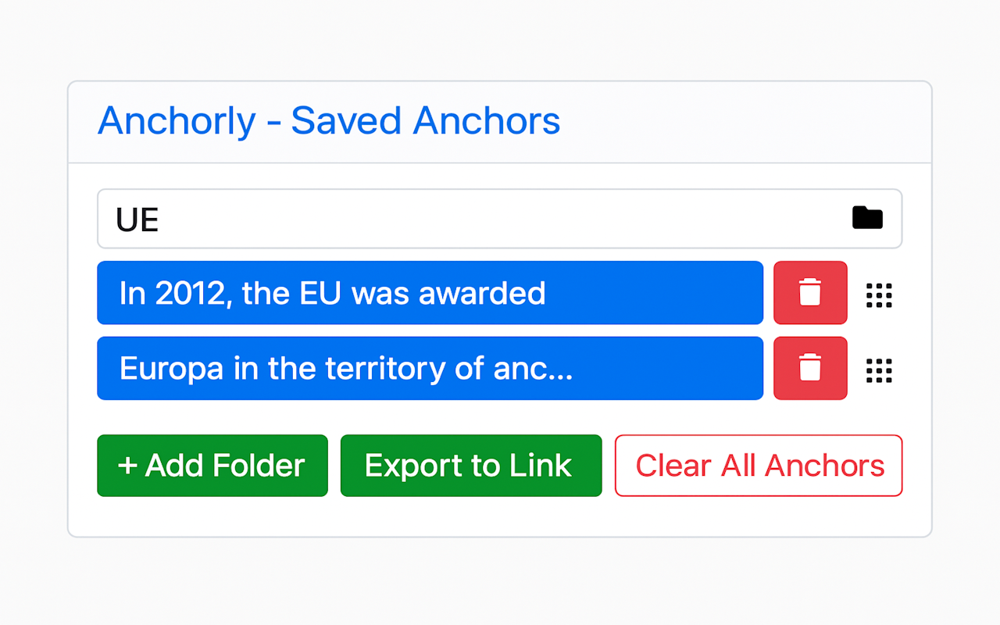

# Anchorly

> **Free anchor saver Chrome extension to highlight, organize, and revisit selected text on webpages.**

🔗 **Install it from the Chrome Web Store**:  
[https://chromewebstore.google.com/detail/anchorly/gkidejbpflnmjbdkpmpfehchlamchhej](https://chromewebstore.google.com/detail/anchorly/gkidejbpflnmjbdkpmpfehchlamchhej)

---

## 🧠 Overview

Anchorly is a powerful yet lightweight Chrome extension that lets you highlight, save, and revisit text from any webpage. Whether you’re reading articles, conducting research, studying, or curating content, Anchorly makes it easy to keep track of what matters.

### 🔧 Features

- Instantly save text with right-click or shortcut
- Highlight selections directly on the page
- Organize anchors into custom folders
- Revisit and jump to anchors with a click
- Export anchors as shareable links
- No login or registration required

### 💡 Why Anchorly?

- ✅ Free to use  
- ✅ Works on all websites  
- ✅ Zero tracking, zero ads  
- ✅ Local-only storage for privacy  

---

## 📸 Screenshots

---